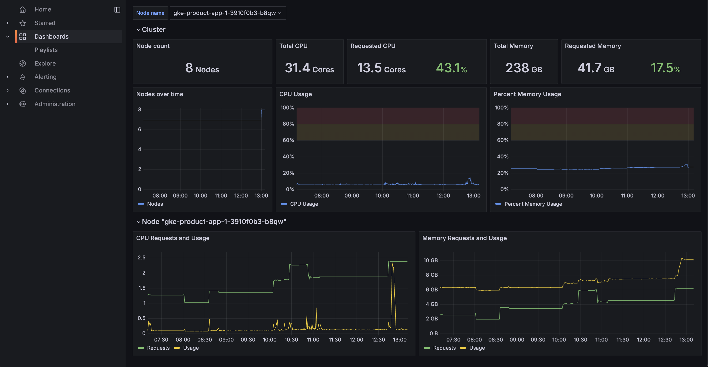
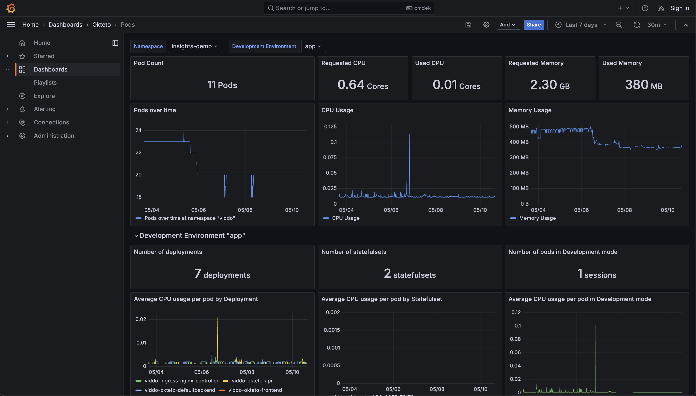
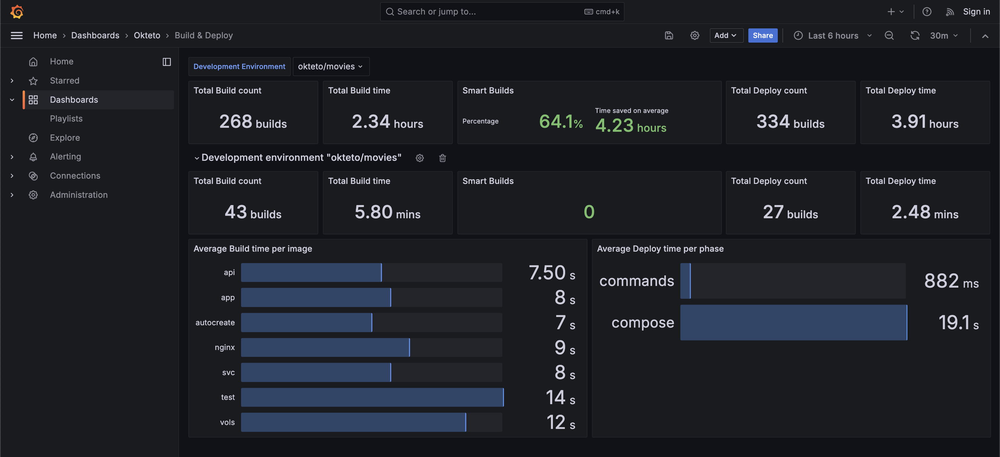
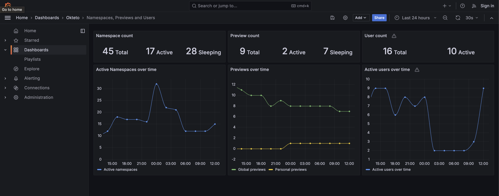

# insights-dashboards
A Prometheus scraper and collection of Grafana dashboards for Okteto Insights

## Sample Dashboards
There are four sample dashboards to help you start exploring the data provided by Okteto Insights.

### Node Metrics



The Node Metrics dashboard is designed to give you a high level overview of cluster health. Focusing on CPU and Memory utilization, this can help you determine if your dev cluster has resources over-provisioned or under-provisioned.

#### Variables:

* **Node Name**: The name of the Kubernetes node to display specific data for.


### Pod Metrics



The Pod Metrics dashboard shows lower level information related to each Kubernetes Pod. This can help you to analyze the performance (memory leaks, CPU optimization, etc.) of the application code running in a particular namespace.

#### Variables

* **Namespace**: The name of the Okteto Namespace to display specific data for, filtered by the selected `Development Environment`
* **Development Environment**: The specific Okteto Development environment to display data for.

### Build and Deploy Metrics



The Build and Deploy Metrics dashboard helps you understand how your application has been evolving over time by giving you data related to build and deploy times.

#### Variables
* **Development Environment**: Representing the name of the git repository to display specific metrics for. You can choose to see these metrics for the whole cluster or a particular application you have.

### Namespace, Preview, and User Metrics



The Namespaces, Previews, and Users dashboard gives you metrics which help you measure how the platform is being adopted and used across your organization.

## Installation: Deploy Prometheus for Metric Scraping and Grafana for Dashboard Visualization

The following sections outline deployment steps for setting up a Prometheus and Grafana bundle that will scrape metrics from [Okteto Insights](https://www.okteto.com/docs/core/okteto-insights/), covering both Okteto and standalone setups.

However, it's important to note that while the provided deployment solution is suitable for testing and development purposes, it may not be optimal for production scenarios.

If deployed via Okteto, it will be protected by default via [Private endpoints](https://www.okteto.com/docs/core/endpoints/private-endpoints/), but if deployed standalone it will be accessible by anyone with network access.

For production deployments, consider adjusting the settings to fit your security, scalability and persistence requirements.

| Environment Variable | Default Value | Description |
|-|-|-|
| `PROMETHEUS_CHART_VERSION` | `25.19.1` | The version of the Prometheus chart to be deployed. |
| `GRAFANA_CHART_VERSION` | `7.3.7` | The version of the Grafana chart to be deployed. |
| `PROMETHEUS_RELEASE_NAME` | `prometheus` | The name of the Prometheus release. |
| `GRAFANA_RELEASE_NAME` | `grafana` | The name of the Grafana release. |
| `PROMETHEUS_ARGS` | default helm chart installation flags | Main arguments for deploying the Prometheus chart. |
| `GRAFANA_ARGS` | default helm chart installation flags | Main arguments for deploying the Grafana chart. |
| `PROMETHEUS_EXTRA_ARGS` | | Extra arguments for the Helm upgrade command when deploying Prometheus. |
| `GRAFANA_EXTRA_ARGS` | | Extra arguments for the Helm upgrade command when deploying Grafana. |

### Okteto

#### Prerequisites

Before deploying with Okteto, make sure you have the following prerequisites:

- Okteto CLI installed and configured
- Access to the Okteto namespace where you want to deploy Prometheus and Grafana

#### Deployment Steps

1. Set up the `INSIGHTS_TOKEN` variable:
   - Create the `INSIGHTS_TOKEN` variable as a user or admin [Okteto variable](https://www.okteto.com/docs/core/okteto-variables/).
   
2. Run the deployment command or deploy the repository from the Okteto UI:
   ```bash
   okteto deploy
   ```

This will deploy Prometheus and Grafana using the values of the `INSIGHTS_TOKEN` variable from the Okteto environment.

### Standalone

#### Prerequisites

Before deploying standalone, make sure you have the following prerequisites:

- Access to the Kubernetes cluster where you want to deploy Prometheus and Grafana

#### Deployment Steps

1. Set up the environment variables:
   - Ensure both `INSIGHTS_TOKEN` and `DOMAIN` variables are exported.

2. Run the deployment command:
   ```bash
   make add-helm-repos
   ```
   ```bash
   make deploy-prometheus
   ```
   ```bash
   make deploy-grafana
   ```

This will deploy Prometheus and Grafana using the exported values of `INSIGHTS_TOKEN` and `DOMAIN` variables.

## Prometheus Operator

To scrape Prometheus metrics from [Okteto Insights](https://www.okteto.com/docs/core/okteto-insights/) using [Prometheus Operator](https://prometheus-operator.dev/), follow these steps:

1. **Ensure prerequisites:**
   - [Prometheus Operator](https://prometheus-operator.dev/) is installed in the cluster, and its version is higher than 0.65.1.
   - The CRD for [`ScrapeConfig`](https://prometheus-operator.dev/docs/user-guides/scrapeconfig/) is correctly installed in the cluster.

2. **Apply the following [`ScrapeConfig`](https://prometheus-operator.dev/docs/operator/api/#monitoring.coreos.com/v1alpha1.ScrapeConfigSpec) manifest in the `okteto` namespace:**

   ```yaml
   apiVersion: monitoring.coreos.com/v1alpha1
   kind: ScrapeConfig
   metadata:
     name: okteto
     namespace: okteto
     labels:
       instance: okteto
   spec:
     staticConfigs:
     - targets:
       - okteto.yourinstancedomain.com:443
     scheme: HTTPS
     authorization:
       credentials:
         key: bearer
         name: okteto-insights
   ```

   Replace `okteto.yourinstancedomain.com` with your Okteto instance address. Refer to the following documentation for getting this value:
   - [Okteto Subdomain Configuration](https://www.okteto.com/docs/self-hosted/helm-configuration/#subdomain)
   - [Okteto Public Override Configuration](https://www.okteto.com/docs/self-hosted/helm-configuration/#publicoverride)

   If you customized your Helm release `insights.bearerSecret` configuration, replace `spec.authorization.credentials` accordingly. Refer to the following documentation for more information:
   - [Okteto Insights Configuration](https://www.okteto.com/docs/self-hosted/helm-configuration/#insights)

3. **Label the `okteto` namespace:**

   ```sh
   kubectl label ns okteto prometheus-operator=okteto-insights
   ```

4. **Update your Prometheus Operator instance with the following sections:**

   ```yaml
   spec:
     scrapeConfigSelector:
       matchLabels:
         instance: okteto
     scrapeConfigNamespaceSelector:
       matchLabels:
         prometheus-operator: okteto-insights
   ```

These steps will configure your Prometheus Operator to scrape metrics from Okteto Insights.
